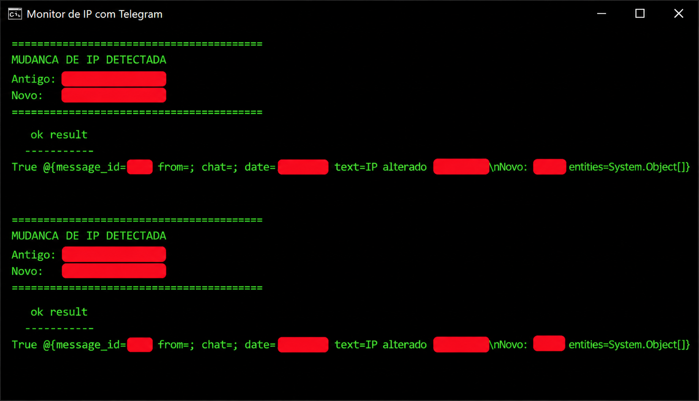

# Monitor-IP-Telegram-bat
Detecção de mudança de IP .bat com monitoramento via Telegram

```ruby
@echo off
title Monitor de IP com Telegram
setlocal enabledelayedexpansion

:: ===== CONFIGURACOES =====
set TOKEN=DIGITE SEU TOKEN AQUI
set CHAT_ID=DIGITE SEU ID AQUI
set FILE_IP=ip_atual.txt
set INTERVALO=60
:: ===========================

:LOOP

:: Obtendo IP publico
for /f "delims=" %%i in ('powershell -Command "(Invoke-RestMethod -Uri 'https://api.ipify.org')"') do set IP_ATUAL=%%i

if not exist %FILE_IP% (
    echo %IP_ATUAL% > %FILE_IP%
    echo IP inicial detectado: %IP_ATUAL%
    goto WAIT
)

set /p IP_ANTIGO=<%FILE_IP%

if not "%IP_ATUAL%"=="%IP_ANTIGO%" (
    echo.
    echo MUDANCA DE IP DETECTADA!
    echo Antigo: %IP_ANTIGO%
    echo Novo:   %IP_ATUAL%

    echo %IP_ATUAL% > %FILE_IP%

    powershell -Command ^
    "$msg=' IP alterado!`nAntigo: %IP_ANTIGO%`nNovo: %IP_ATUAL%';" ^
    "Invoke-RestMethod -Uri 'https://api.telegram.org/bot%TOKEN%/sendMessage' -Method Post -Body @{chat_id='%CHAT_ID%';text=$msg}"
)

:WAIT
timeout /t %INTERVALO% /nobreak > nul
goto LOOP
```

```text

Esse script é um monitor de IP público automatizado. Ele serve para quem tem internet com IP dinâmico (que muda de tempos em tempos) e precisa saber o IP atual da rede (por exemplo, para acessar um servidor caseiro, VPN ou câmera de segurança de fora de casa).

```
# 1. Inicialização e Configuração

```text
Ele define as variáveis básicas: o seu Token do bot do Telegram, o seu ID do Chat, o nome do arquivo que vai guardar o IP atual (ip_atual.txt) e o tempo de espera entre cada checagem (60 segundos).
```

# 2. A Checagem do IP (O Loop)

```text
O script entra em um loop infinito (:LOOP) e faz o seguinte:

Descobre seu IP público: Ele "chama" o PowerShell em segundo plano para fazer uma requisição ao site [https://api.ipify.org](https://api.ipify.org). Esse site apenas responde com o seu endereço de IP de internet atual. Ele salva essa informação na variável %IP_ATUAL%.
```

# 3. Primeira Execução (Criação do arquivo)

```text
O script verifica se o arquivo ip_atual.txt já existe.

Se não existir (primeira vez rodando): Ele cria o arquivo escrevendo o IP atual dentro dele, mostra a mensagem "IP inicial detectado" na tela e pula direto para a contagem de tempo para esperar a próxima checagem.
```

# 4. A Comparação (Se o arquivo já existir)

```text
Ele lê o IP que estava salvo dentro de ip_atual.txt e guarda na variável %IP_ANTIGO%.

Ele compara: O IP atual é igual ao IP antigo?

Se for igual: Ele não faz nada e vai para o passo de espera.

Se for diferente (O IP mudou!):

1.Exibe um alerta na tela: MUDANCA DE IP DETECTADA!.

2.Sobrescreve o arquivo ip_atual.txt com o novo IP para as próximas checagens.

3.Dispara uma requisição (novamente usando o PowerShell em segundo plano) para a API do Telegram, enviando uma mensagem privada para você com o IP antigo e o novo.
```
# 5. A Espera

```text
Ele usa o comando timeout para esperar 60 segundos (ou o tempo que você configurou) e depois volta para o início (goto LOOP) para fazer tudo de novo.
```

# Terminal



